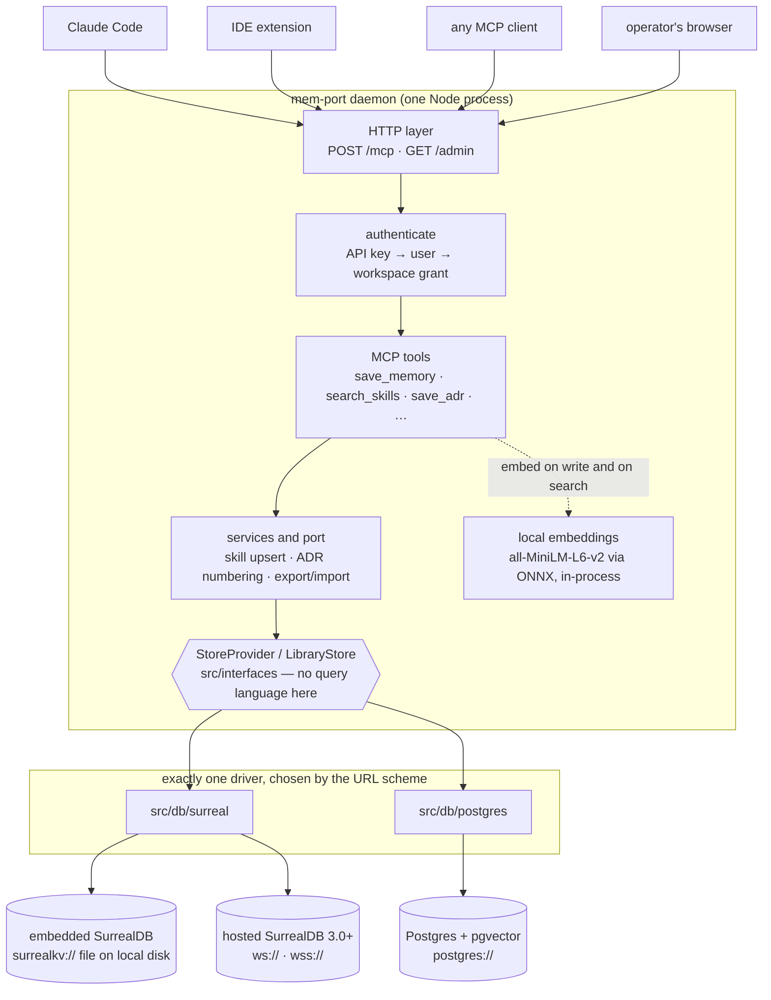

# Deployments

| Folder | What it is |
|---|---|
| [`docker/`](docker/) | The container image, plus a Compose stack per database engine — [SurrealDB](docker/docker-compose.yml) or [Postgres](docker/docker-compose.postgres.yml) — run the way a real deployment does |
| [`gcp/`](gcp/) | Cloud Run service definition and a deploy script |

## How it fits together

Everything below is one Node process plus one database. The load-bearing line is
the storage contract in the middle: everything above it is written in domain
terms, everything below it is one engine's dialect, and which engine you get is
decided by nothing but the scheme of `MEM_PORT_DB_URL`.



Three things that diagram is trying to earn:

- **Embeddings are in-process.** There is no vector service and no embedding
  API; the ONNX model runs inside the daemon, which is why sizing is about CPU
  and memory rather than about a second network hop, and why nothing you write
  leaves the host.
- **Tenancy is below the contract, not above it.** The `library-id` header names
  a workspace, and the driver turns that into a whole database (SurrealDB) or a
  whole schema (Postgres). Isolation is structural: a query names its own
  workspace and cannot reach another's rows.
- **The driver is the only thing that changes.** Swap the URL and nothing above
  the contract moves — which is a claim
  [`test/crossDriver.test.ts`](../test/crossDriver.test.ts) checks by running one
  fixture through both engines and diffing every tool's output byte for byte.

## Read this first

**Authentication follows exposure.** On loopback it is off, because the
operating system is already the boundary. On any other interface it is
required, so a deployed daemon is closed by default rather than depending on
whoever wrote the deploy config.

That means a deployment needs a bootstrap admin, or it will refuse to start:

```
MEM_PORT_ADMIN_USER=admin
MEM_PORT_ADMIN_PASSWORD=<a real secret, from Secret Manager>
```

Then sign in at `/admin` to create workspaces, add users, issue their API keys
and grant access. Clients send `Authorization: Bearer <key>` alongside
`library-id`.

The manifests here still default to closed at the network layer as well —
Compose publishes on loopback, Cloud Run uses internal ingress with invoker auth
required — because defence in depth is cheap and an exposed admin panel is worth
one more lock.

## You need a networked database

The default embedded database (`surrealkv://`) writes to local disk. That is
wrong anywhere the filesystem is ephemeral or more than one instance runs — you
would lose data when a container is replaced, and replicas would silently
diverge. Either engine works; nothing above mem-port's storage contract can tell
them apart, which
[`test/crossDriver.test.ts`](../test/crossDriver.test.ts) asserts by comparing
every tool's output byte for byte.

**Hosted SurrealDB** — three constraints, all checked at startup:

- server **3.0.0+** — sessions and transactions are 3.0 features, and mem-port
  needs both (a session per library-id for tenancy, a transaction for
  `import_library`)
- **`ws://` or `wss://`** — the HTTP engine supports neither, at any version
- a **root- or namespace-level user** — mem-port creates a database per
  library-id and defines its schema on first use

**Postgres** — needs the `pg` package (`npm install pg`, an optional
dependency) and the **pgvector** extension, since every search mem-port offers
is a cosine similarity over an embedding. mem-port attempts `CREATE EXTENSION`
itself, which works on most managed services where it is available but not
enabled. Each workspace gets its own schema, so isolation is structural rather
than a `WHERE` clause.

Choose Postgres if you already operate Postgres or want a managed service with
backup and replication tooling you know — on GCP that means Cloud SQL, which is
usually less work than running SurrealDB on a VM.

## The first admin

Binding anything other than loopback makes authentication required, so a
deployment needs a bootstrap admin or **the daemon refuses to start**:

```bash
export MEM_PORT_ADMIN_PASSWORD='something-real'
```

Both Compose files require it deliberately rather than shipping a default —
a default admin password is exactly the kind of thing that survives into
production. It is used only while no admin exists, so leaving it set cannot
reset a password later.

## Local

```bash
export MEM_PORT_ADMIN_PASSWORD='local-dev-password'

# SurrealDB
docker compose -f deployments/docker/docker-compose.yml up --build

# or Postgres
docker compose -f deployments/docker/docker-compose.postgres.yml up --build

# if a locally installed mem-port already holds 8787:
MEM_PORT_HOST_PORT=8799 docker compose -f deployments/docker/docker-compose.yml up --build
```

Each brings up its database with a volume and mem-port pointed at it, then
serves the admin panel at `/admin`. Configuration is
[`.env.example`](../.env.example); copy it to `.env` for local runs of the
daemon outside Docker.

## Cloud Run

```bash
PROJECT_ID=my-project REGION=us-central1 ./deployments/gcp/deploy.sh
```

See [`gcp/README.md`](gcp/README.md) for what to set up first and how clients
connect.
